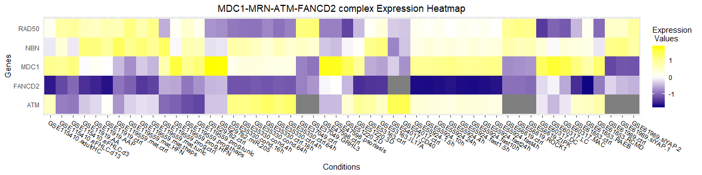
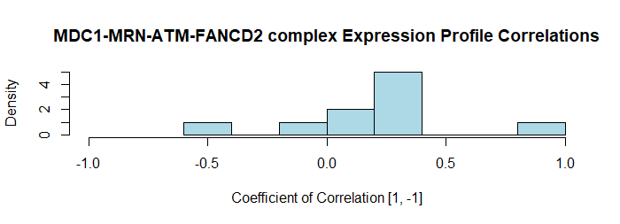
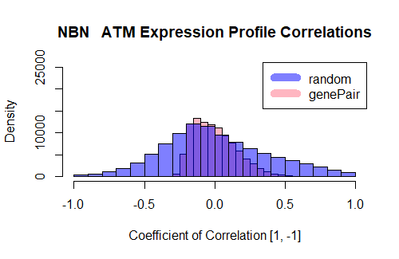

<!--- this inline style supports diff-like highlighting -->
<style>
  .add {
    color: #22863a;
    background-color: #f0fff4;
  }
  .del {
    color: #b31d28;
    background-color: #ffeef0;
  }
</style>

```{r setup, include = FALSE}
knitr::opts_chunk$set(
  collapse = TRUE,
  comment = "#>"
)

# knitr knits in a new session with an empty global workspace after setting its
# working directory to ./vignettes. To make your package functions available in
# the vignette, you have to load the library. The following two lines should
# accomplish this without manual intervention:
pkgName <- trimws(gsub("^Package:", "", readLines("../DESCRIPTION")[1]))
library(pkgName, character.only = TRUE)

```
&nbsp;

<div style="font-size:90%;border:solid 1px #337ab7;background-color:#FAFBFC;margin-right:0px;">
There are many links and references in this document. If you find anything here
ambiguous, inaccurate, outdated, incomplete, or broken, please
[file an issue](https://github.com/hyginn/BCB420.2019.ESA/issues)!
</div>

&nbsp;

# About this Vignette

This sample Vignette explains the BCB420.2019.ESA subunitcoExpressionAnalysis.R and result interpretation.

# Complex subunits coexpression analysis
Here is a demo analysis done by subunitcoExpressionAnalysis.R using MDC1-MRN-ATM-FANCD2 complex:
First we could visualize the expression profile of the subunit of the give complex. 
```R
complex <- "MDC1-MRN-ATM-FANCD2 complex"
complexExpHeatmap(complex)
# output message:
# The subunits of MDC1-MRN-ATM-FANCD2 complex :
# [1] "NBN"    "MRE11A" "ATM"    "MDC1"   "RAD50" 
# [6] "FANCD2"
```

The heatmap is generated shown below:
```{r, echo = FALSE}

```
From this heatmap, we do not see any overall similirity of patterns for complex subunits. However, we can consistent negative expression of FANCD2 across experiments, which might be an interesting insights for future studies.

Then we could generate the data frame comtaining each pair of genes and their Pearson Correlation Coefficients  if their coexpression. 

```R
expProfile <- getCoExpProfile(complex)
head(expProfile)
# Example expProfile
# Gene1  Gene2 Correlation
# 1   NBN    ATM  0.86668986
# 2   NBN   MDC1  0.21755978
# 3   NBN  RAD50  0.07553847
# 4   NBN FANCD2  0.26065913
# 5   ATM   MDC1  0.22767125
# 6   ATM  RAD50 -0.07448198
```

A distribution of the coexpression correlation of pairwise genes are displayed for visulization.
```{r, echo = FALSE}

```

To figure out which pair of genes are significantly differentially coexpressed, we use the following ling:
```R
pairExpHist(expProfile)
# output of gene pair(s) with significant different coexpression
#   Gene1 Gene2 Correlation Correlation
# 1   NBN   ATM   0.8666899  0.02012159
```
There is one pair of gene(NBN, ATM) that is differentially positivly coexpressed with a p-Value of 0.02012159. However, there are no gene pairs have significant negative coexpression for this complex. 
```{r, echo = FALSE}

```
We use the distribution shown below for visulization. It compares the coexpression profile of 100000 random pair of genes and coexpression correlation of shuffled expression values of NBN and ATM for 100000 times. The NBN and ATM coexpression profile is obviously right skewed. 


# Session Info

This release of the `BCB420.2019.ESA` package was produced in the following context of supporting packages:

```{r, echo=TRUE}
sessionInfo()
```

<!-- the bibliography appears at the end of the page -->
# References


<!-- End -->
