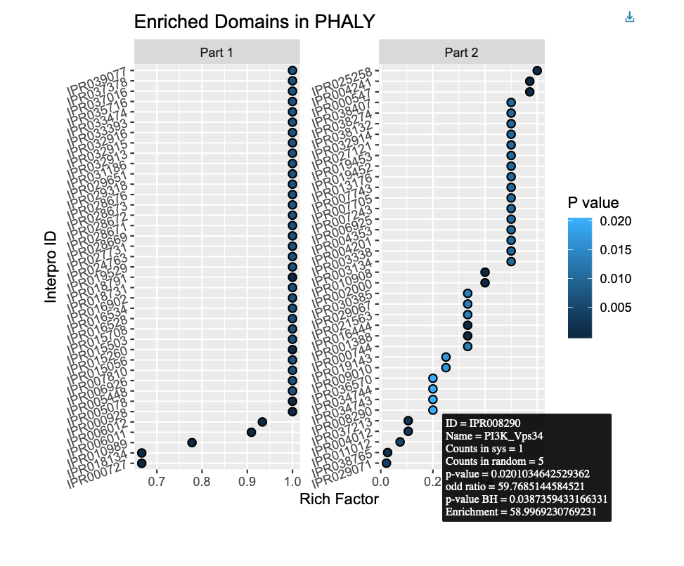

<!--- this inline style supports diff-like highlighting -->
<style>
  .add {
    color: #22863a;
    background-color: #f0fff4;
  }
  .del {
    color: #b31d28;
    background-color: #ffeef0;
  }
</style>


```{r setup, include = FALSE}
knitr::opts_chunk$set(
  collapse = TRUE,
  comment = "#>"
)
# knitr knits in a new session with an empty global workspace after setting its
# working directory to ./vignettes. To make your package functions available in
# the vignette, you have to load the library. The following two lines should
# accomplish this without manual intervention:
pkgName <- trimws(gsub("^Package:", "", readLines("../DESCRIPTION")[1]))
library(pkgName, character.only = TRUE)
```

&nbsp;

<div style="font-size:90%;border:solid 1px #337ab7;background-color:#FAFBFC;margin-right:0px;">
There are many links and references in this document. If you find anything here
ambiguous, inaccurate, outdated, incomplete, or broken, please
[file an issue](https://github.com/hyginn/rpt/issues)!
</div>

&nbsp;

# About this vignette
This vignette [@steipe-rptPlus] demonstrates the use of `domainEnrichment()` function in `BCB420.2019.ESA` package.

The function interpret the enriched domains in desired system. The input is the system code and the output is a plot and return a data frame with data.

The enriched domains could be further used to indicate enriched gene funcitons, or help define subsystems with same domains, or identify genes with very special role in the system or identify anomalies.

&nbsp;

## InterPro Data
This function use data from [InterPro](https://www.ebi.ac.uk/interpro/)[@pmid30398656] and fetched by `fetchData()`.

InterPor data is two large lists that store the mapping from HGNC symbol to domain ID and domain ID to HGNC symbol for genes. It is fetched by Dr. Steipe.

&nbsp;

## Fisher exact test
[Fisher exact test](https://www.pathwaycommons.org/guide/primers/statistics/fishers_exact_test/) is used to calculate p-value. Contingency table are generated and p-value is calculated by `stats::fisher.test()`[@72556].

Example contingency table for a domain:
```{r, echo=FALSE, results='asis'}
x <- matrix(c("x","k-x","k", "m-x", "n-(k-x)", "m+n-k", "m", "n", "m+n"),nrow=3, ncol=3)
nuc <- c("A", "G", "C", "T")
colnames(x) <- c("Have domain", "Not have domain", "Total")
rownames(x) <- c("In System", "Not in System", "Total")
knitr::kable(x,
             caption = "Example Contingency Table",
             align = "c")
```

* where m is number of genes in system, n is number of genes output system, k is number of genes that have a specific domain.

&nbsp;

## Multiple test
[Multiple test](https://www.pathwaycommons.org/guide/primers/statistics/multiple_testing/) is used to controlling the false discovery rate (FDR). This funciton uses Benjamini-Hochberg control.

&nbsp;

# Example
## Run the function
First of all, we need to know the exist system code for us to analyze:
```{r, eval=TRUE, include=TRUE}
names(SyDBgetRootSysIDs(fetchData("SysDB")))
```

Then, user can choose on system code as input for `domainEnrichment()`. Here I use "PHALY" as example:
```{r, eval=TRUE, include=TRUE, results = "hide"}
exampleOutcome <- domainEnrichment("PHALY") # alpha value is 0.05 by default
```

&nbsp;

## Results
The header of the output data frame:
```{r}
head(exampleOutcome)
```

The example outcome looks like this:

(Temporarily removed to reduce vignette size)

<!-- Temporarily remove to reduce vignette size
```{r, echo=FALSE}

```
-->

&nbsp;

## Interpret
The return value for the function is a data frame that contains domain ID, description, and data analysis information.

The output plot contains all the domains that pass the Benjamini-Hochberg control, adjust p-value is smaller than alpha. The null hypothsis is that categories are independent. The smaller p-value means that they reject null hypothesis and the categories are not independent. Thus the domain is more enriched in the system.

The enriched domain could be used to interpret more about the system:

* The enriched domains can indicate the enriched gene functions in the system and have the sense of possible mechanism in the system

* If generate a large map with the enriched domain of lots of systems, is it possible to predict what kinds of systems a new gene may involved by knowing the domains in it.

* If the system is too big, the enriched domains may be useful to define subsystems

* If the system do have very specific enriched domains, genes that not have enriched domains but still involved in the system may have very specific role in the system or maybe anomalies

&nbsp;

# Session Info

This release of the `BCB420.2019.ESA` package was produced in the following context of supporting packages:

```{r, echo=TRUE}
sessionInfo()
```

<!-- the bibliography appears at the end of the page -->
# References

<!-- End -->
